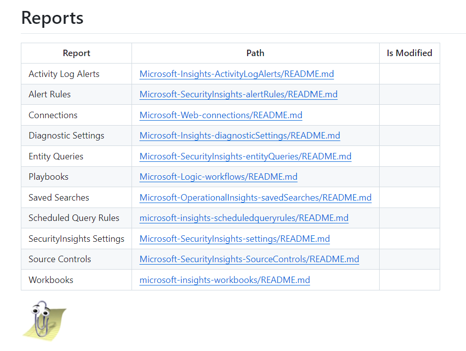
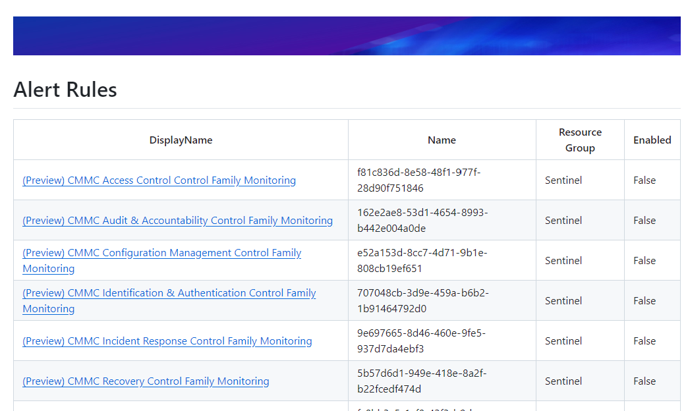
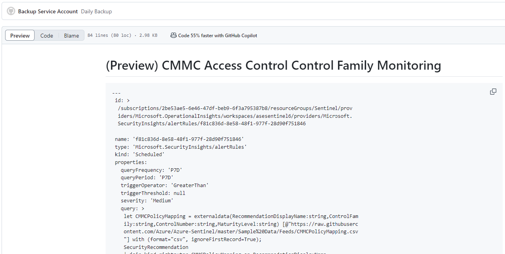

# Audit Reports

After a repository has been backed up with its nightly schedule, **generate-audit.ps1** is called.  This script recursively calls all scripts in the **\.github/workflows/audit-resources** directory.  These scripts are templated and easy to add additional reports to.

The default reports are of interest to Security Teams using Sentinel.

All reports start by declaring the Azure namespace they want to query against and will provide a friendly name for the output report.

```powershell
$ObjectType = "microsoft.insights/scheduledqueryrules"
$Friendlyname = "Scheduled Query Rules"
```

Knowing the object type, the audit reporting recursion looks at all downloaded JSON for objects of that namespace.

I'll create a dedicated class object for the properties I want in my final report.

```powershell
# Create a Report object class to contain all the harvested fields that interest me.
# This will be unique with each report
# this will allow results to be sorted before being written to file

Class oResult{
    [String]$displayName
    [String]$Name
    [String]$ResourceGroup
    [String]$enabled
}
```

As the script recurses through the backup up Azure objects, it looks for the object type I specified, creates a new result object and populates it with the data I want in the report.

```powershell
# Recurse through the file list index and open all of those of our desired type
foreach($file in $FileList){

 # Select the desired object type
 if ($file.Type -eq $ObjectType){
     $otemplate = Get-Content -Raw -Path  $file.Path | ConvertFrom-Json

     $otemp = New-Object oResult
     $otemp.DisplayName = $otemplate.properties.DisplayName
     $otemp.Name = $otemplate.Name
     $otemp.ResourceGroup = ($otemplate.id).split('/')[4]
     $otemp.enabled = $otemplate.properties.enabled

     $OutputArray += $otemp
```

The $otemplate object is the JSON representation of the Azure object.  As the script finds objects to report on, it adds them to the output collection.

The remainder of the script is used for writing the object as yaml to the reports folder and creating a markdown menu for the reports.



This leads to a submenu for the reports.



And ultimately yaml reports for the various elements I have backed up.




